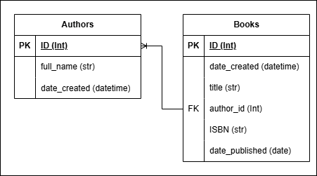

# Biblioteca API

API REST para gestionar una biblioteca, desarrollada con **FastAPI** y **PostgreSQL**.

## Características

- Permite **crear, leer, actualizar y eliminar** libros y autores.
- Búsqueda de libros por **autor y/o año de publicación**.
- **Documentación automática** con Swagger.
- **Pruebas automatizadas** con Pytest.
- Contenerización con **Docker**.

## Tecnologías Utilizadas

- **FastAPI** - Framework principal.
- **PostgreSQL** - Base de datos.
- **SQLAlchemy** - ORM para interactuar con la base de datos.
- **Pytest** - Pruebas unitarias e integración.
- **Docker** - Contenerización de la aplicación.

## Instalación y Ejecución

### 1. Clonar el Repositorio

```sh
git clone https://github.com/Alberto7526/Biblioteca_FastApi.git
cd biblioteca_api
```

Se decidió incluir el archivo de variables de entorno .env en el repositorio para simplificar la configuración y evitar pasos adicionales para los evaluadores.

### 2. Construir y Levantar los Contenedores

```sh
docker-compose up -d
```

Esto iniciará la API y PostgreSQL en contenedores.

### 3. Acceder a la API

- **Swagger UI**: [http://localhost:8000/docs](http://localhost:8000/docs)
- **Redoc**: [http://localhost:8000/redoc](http://localhost:8000/redoc)

## Diagrama Entidad Relación

Se agregó la tabla autor para evitar repetición de datos en la base de datos, como se muestra a continuación:



## Endpoints Principales

### Autores

| Método | Endpoint        | Descripción               |
| ------ | --------------- | ------------------------- |
| POST   | `/authors/`     | Crear un autor            |
| GET    | `/authors/`     | Obtener todos los autores |
| GET    | `/authors/{id}` | Obtener un autor por ID   |
| PUT    | `/authors/{id}` | Actualizar un autor       |
| DELETE | `/authors/{id}` | Eliminar un autor         |

### Libros

| Método | Endpoint         | Descripción                     |
| ------ | ---------------- | ------------------------------- |
| POST   | `/books/`        | Crear un libro                  |
| GET    | `/books/`        | Obtener todos los libros        |
| GET    | `/books/{id}`    | Obtener un libro por ID         |
| PUT    | `/books/{id}`    | Actualizar un libro             |
| DELETE | `/books/{id}`    | Eliminar un libro               |
| GET    | `/books/search/` | Buscar libros por autor y/o año |

## Ejecutar Pruebas

Para ejecutar las pruebas dentro del contenedor:

```sh
docker-compose exec app pytest --import-mode=importlib
```

## Preguntas Adicionales

### **1. ¿Cómo manejarías la autenticación y autorización en la API?**

Se implementaría **OAuth2 con JWT** para autenticación y permisos basados en roles. FastAPI ya cuenta con soporte para esta implementación, acontinuación dejo los enlaces a la documentación.

[Simple OAuth2 con Password y Bearer](https://fastapi.tiangolo.com/es/tutorial/security/simple-oauth2/)

[OAuth2 con Password (y hashing), Bearer con tokens JWT](https://fastapi.tiangolo.com/es/tutorial/security/oauth2-jwt/)

### **2. ¿Qué estrategias utilizarías para escalar la aplicación?**

- **Balanceo de carga** con Nginx o traefik.
- **Trabajarlo con microservicios** para mejorar la disponibilidad y escalado de forma sencilla.

### **3. ¿Cómo implementarías la paginación en los endpoints que devuelven listas de libros?**

Usando `limit` y `offset` en SQLAlchemy, ya que `limit` permite indicar cuantos elementos se desea traer en la consulta y `offset` permite indicar desde que elemento se indicara traer (No por Ids sino por cantidad de elementos que arroje la consulta)

```python
@app.get("/books/")
def get_books(limit: int = 10, offset: int = 0):
    return db.session.query(Book).offset(offset).limit(limit).all()
```

### **4. ¿Cómo asegurarías la seguridad de la aplicación?**

- **Protección contra inyección SQL** El uso de SQLAlchemy como ORM permite realizar consultas a la base de datos sin escribir propiamente SQL lo que ayuda a mitigar este problema
- **Validación de entrada con Pydantic** Una de las ventajas de pydantic es la validación de los parametros de entrada lo que permite controlar errores de usuario y recibir información no deseada.
- **Autenticación segura** impelmetación de sistemas de autenticación como oauth2 para manejo de tokens de autenticación

---
